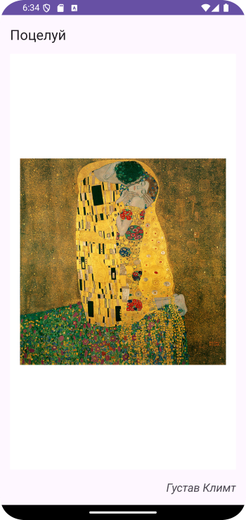

# Домашнее задание по теме "ViewPager2"

## Приложение «Картинная галерея».

Необходимо написать приложение с использованием элемента **ViewPager2.** Галерея состоит из не менее, чем 10 картин(фото) с названием картины вверху экрана и автором картины снизу и справа экрана. Слайдер работает в правую и левую стороны.

Для работы приложения необходимо создать:

1. Фрагмент для слайдера экранов. В файле фрагмента расположены два поля вывода **TextView:** название картины и автор картины, **ImageView** для расположения самой картины.

2. Класс модели **Picture**, в котором содержатся свойства названия, автора и изображение.

3. Список объектов класса **Picture**, для хранения созданных картин.

4. Класс адаптера, для предоставления фрагментов для слайдера.

Логика класса фрагмента и **MainActivity** реализуется аналогично тематики занятия.

Приложение необходимо сохранить проектом в удаленном репозитории, для проверки качества предоставить ссылку преподавателю, либо сделать скрины эмулятора при каждом шаге работы приложения или снять видео экрана при работе приложения.

## Скриншоты домашнего задания по теме "ViewPager2"

Скриншоты здесь

